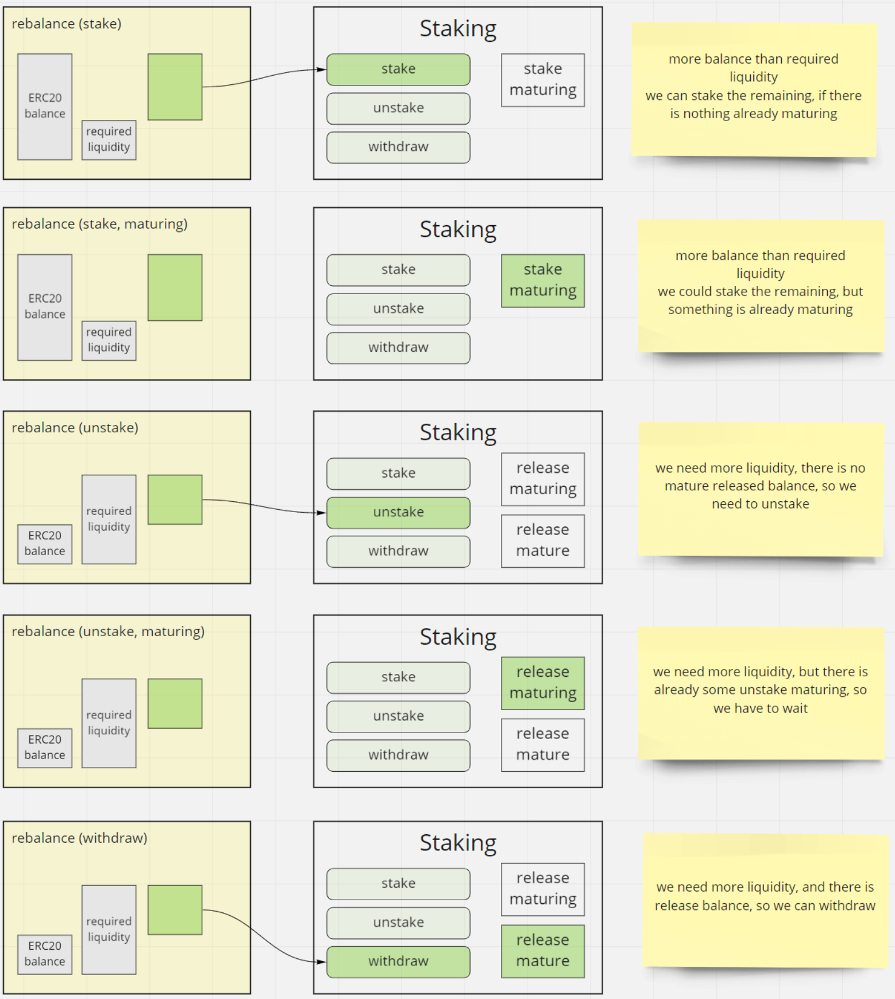

> :warning: The Cartesi team keeps working internally on the next version of this repository, following its regular development roadmap. Whenever there's a new version ready or important fix, these are published to the public source tree as new releases.

# PoS Staking Pools

This repository hosts smart contracts that enable individuals or institutions to create Staking Pools on top of [Cartesi Proof of Stake system](https://github.com/cartesi/pos-dlib).

The `StakingPool` acts as a regular user of the Cartesi Proof of Stake system, so it's interesting to know how it works before managing a pool. [Noether Node](https://github.com/cartesi/noether) also integrates this pool system.

In order to improve maintainability and auditing, the pool contract is composed of five facets:

-   [Staking](#staking)
-   [User](#user)
-   [Worker](#worker)
-   [Management](#management)
-   [Block producer](#block-producer)

Here is the overview diagram:

<p align="center"></p>

## Staking

The pool is also a client to the [Staking Contract](https://github.com/cartesi/pos-dlib/blob/master/contracts/StakingImpl.sol) part of the Cartesi PoS. So we define the behavior of staking, unstaking, and withdrawing CTSI amounts.

The main function responsible for managing these actions is `rebalance()` function. When called, the function decides (based on `amounts()` function response) whether it should stake, unstake or withdraw any CTSI value. The logic for the decision is encapsulated under `amounts()` and is as follows:

-   Anytime a user wants to exit the pool, we add his requested amount to the `requiredLiquidity`, which is the overall liquidity necessary to fulfill all users' requests to leave the pool.

-   It checks for any free balance under the contract's account on the ERC20 ledger (let's call it `balance`). If it's more than the `requiredLiquidity`, then it means it has an outstanding value that can be staked on behalf of all the pool. E.g., when a new user joins and asks to stake, then we have this free balance. As a result, the `uint256 stake` is returned with the exact value to be staked.

-   If there was a staking request in less than 6 hours (time to maturate the stake on Cartesi PoS), it won't return the value mentioned before. This prevents a clock reset that would force the previous request to wait for more than 6 hours.

-   In the case of `requiredLiquidity` being more than the current `balance`, this prompts an unstake request. The missing liquidity is returned into `uint256 unstake`.

-   Similarly, with the stake scenario, we need to avoid resetting the 48 hours unstaking clock for the Cartesi PoS. So, if it checks for a releasing balance, and if ready to be withdrawn, we return it into the `uint256 withdraw` variable. Otherwise, it waits for the timeout and returns 0 values for `unstake` and `withdraw` variables.

Here is a diagram displaying this logic. The middle column represents the PoS Staking contract.

<p align="center"></p>

The requirement to call the `rebalance()` function is checked by default every 30 seconds by the pool Noether Node. But if the pool node is not working as it should, any user can call the `rebalance()` function, meaning it's permissionless. This is important to guarantee that users can exit the pool even if its owner abandons the pool.

## User

This section is responsible for exposing controls for the users to join and exit the pool. It implements the following actions: deposit, stake, unstake, and withdraw.

The first step to join the pool is to `deposit()` some CTSI tokens. The user should set an allowance on the ERC20 CTSI contract and then call `deposit()` with the desired stake amount. This action will transfer the tokens to the
pool contract and start a timeout timer for the next step.

> We define a timeout between `deposit()` and `stake()` steps, so the pool is protected against possible exploits. An attacker tries to predict what pool will be the next selected to produce a block and attempts to join it just before it happens so they can participate in the reward without waiting.

After a wait time of 6 hours, the user can call `stake()`, which will decrease their internal balance with the pool in exchange for pool shares. The shares are issued at the current rate of parity between all shares vs. all pool-staked balances.
The user participates in rewards right away.

As a secondary effect, after a call to `stake()` happens, the contract will be ready to stake this new available balance on the Cartesi PoS system, as described in the previous section.

The next natural step is to eventually `unstake()` some quantity of shares. By calling `unstake()`, the user will convert their shares into a CTSI balance at the current exchange rate. As a secondary effect, it will signal to the contract
to also unstake CTSI on the Cartesi PoS, so later it's available for the user to withdraw.

> NOTE: if there is an influx of users at the same time someone tries to leave, that will make the pool contract liquid without calling unstake on Cartesi PoS contracts. As a result, this hypothetical user will be able to exit the pool faster.

Finally, whenever the user has a free balance (after a `deposit` or after calling `unstake`), and the pool also has the required liquidity (active balance on the ERC20 CTSI contract), they are allowed to call `withdraw()` for how much they want to have transferred back to their wallets.
The diagram below illustrates the four operations described above and how they affect the pool and user data.

<p align="center"></p>

## Worker

The Cartesi PoS system has two main external account actors: owner/user and their Noether node worker.

In addition, Noether nodes check for hiring directly on the blockchain; that's how it knows its owner.

Therefore, this section contains the necessary pieces for hiring (self hiring) and managing workers.

-   `selfhire()`: Not meant to be called manually, this function is part of the deployment process inside the factory. It establishes the owner-worker relationship of the pool on the Cartesi PoS system.

-   `hire()`, `cancelHire()`, `retire()`: These functions are connected to configuring a Noether node. Here you select (hire) your node based on its address. Stop the hiring process (cancelHire). Or, retrieves your funds
    from the node before permanently shutting it down (retire).

## Management

For pool management we have a set of functionalities split into two contracts: `StakingPoolManagementImpl` and fees (one of: `FlatRateCommission`, `GasTaxCommission`).

### StakingPoolManagementImpl

-   `setName()`: This function allows the pool manager (owner) to set the name for the pool on the ENS registries.
-   `pause()`/`unpause()`: To the pool manager is reserved the right to stop new deposits and stakes at any time. By calling `pause()`, no user will be allowed to add more CTSI into the pool system. However, they will be able to `unstake()` and `withdraw()` their funds even if the contract is paused.

The commission system for the pools is modular. An external contract linked to the pool is responsible for informing the pool contract of the size of the commission at every newly produced block. At this time, there are two implementations: FlatRateCommission and GasTaxCommission.

### FlatRateCommission

Flat rate is the simplest form of commission possible: a set % of cut of the reward. The owner sets the % they want as a cut for managing the pool systems at the time of deployment. The fee can be lowered at any time. However, it is bounded by two limits when raising the fee:

-   After raising the fee once, they must wait for a predefined timeout to raise it again.
-   They can only raise at most `maxRaise` at a time. (e.g.: maxRaise=5%, so a fee of 3% can only go to 8% in one step)

### GasTaxCommission

The gas tax is a commission rule based on gas costs. The pool manager sets how much gas they want to be reimbursed, and then this contract makes two conversions using Chainlink oracles: gas-> ether-> ctsi. Using oracles, it multiplies the configured gas amount by the current average gasPrice to obtain the equivalent ETH value; then, it converts that ETH value to CTSI by getting the price of the ETH-CTSI pair from a price oracle. The result is the commission taken from the reward.

It also follows the same rules as the FlatRate. The owner can lower the at any time, but it is bounded by two limits when raising the fee:

-   After raising the fee once, they must wait for a predefined timeout to raise it again.
-   They can only raise at most `maxRaise` at a time. (e.g., maxRaise=20000, so a fee of 200000 gas can only go to 220000 in one step)

## Block Producer

In this section, we handle the actual block production in a transaction started by the Noether node. The `produceBlock` function handles the PoS system call and processes the reward by taking a commission and adding the rest into the overall stake.

The commission (fees) are sent directly to the pool manager's wallet. The balance of the pool gets the remaining reward and, because we don't issue new shares at this moment, the distribution automatically happens as intended by increasing the share value.

<p align="center"></p>

## Shares Ratio Mathematics

The system emits shares related to their initial CTSI value staked to maintain control of the balance of users. At the very first time (before rewards) CTSI value is converted in $1:10^9$ shares. It means the base value of CTSI keeps being $10^{18}$ and the shares is $10^{27}$.

In other words, initially, 1 CTSI ($1*10^{18}$ units) = 1 share ($1*10^{27}$ units)

However, as the contract earns rewards for producing blocks, the CTSI amount staked in the pool increases while the shares do not. Now, one share is worth more than before, and newcomers will be issued a smaller share quantity per value compared to the previous ratio.

The calculation is:

$SharesIssued = \frac{StakeValue * TotalShares}{TotalStakedValue}$

These newly issued shares are added to `TotalShares`, and the newly staked value to `TotalStakedValue`. This behavior guarantees that newcomers won't change the ratio of shares<>ctsi.

### Bounds:

There will only ever be `maxSupply` of ERC20 CTSI tokens which is: $1*10^{9}$ CTSI or $1*10^{27}$ unit. The `maxSupply` is very safe for the limits of the uint256 variables that control the stakes in the pool contract.

Regarding shares, at their **lowest value** ratio 1 CTSI = 1 share ($1*10^{27}$ units), if we extrapolate to stake all available CTSI tokens, we still would have: `maxSupply` => $1*10^{27}*10^{9}$ units of shares which is safe for 256 bits, as well.

At the **highest value**, we would have a 1 CTSI staked being awarded `maxSupply` of tokens, creating the ratio: $1*10^{36}$ CTSI = $1*10^{27}$ of shares. In this scenario, a new stake of 1 CTSI would still be $1*10^{9}$ units of shares being that:

$\frac{1*10^{18} * 10^{27}}{10^{36}}$ = $1*10^{9}$

Therefore, the error margin is $1*10^{-9}$ CTSI (that's how much would be lost due to rounding errors).

## Build

To get a list of all available `yarn` targets run:

```shell
% yarn run info
```

## Contributing

Thank you for your interest in Cartesi! Head over to our [Contributing Guidelines](CONTRIBUTING.md) for instructions on how to sign our Contributors Agreement and get started with Cartesi!

Please note we have a [Code of Conduct](CODE_OF_CONDUCT.md), please follow it in all your interactions with the project.

# Authors

-   _Gabriel Barros_
-   _Danilo Tuler_

## License

This repository and all contributions are licensed under
[APACHE 2.0](https://www.apache.org/licenses/LICENSE-2.0). Please review our [LICENSE](LICENSE) file.
